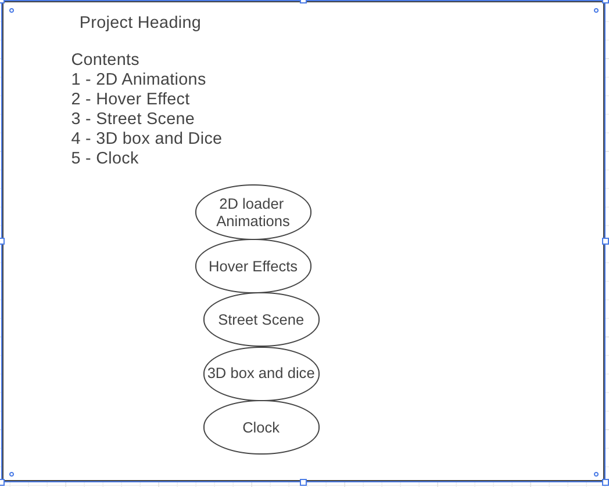

# README

# Introduction 
This is the Flex-animation app. The app demonstrate awesome animations like 2d revolutions, hover effects, 3D effects, a street scene animation and a clock implementation using JS.

# Live Site
to access the app live, go to
https://bilalbilal197.github.io/Flex-JS-Animation/

# technologies used
The technologies for used to build this app include Vanilla Javascript, CSS3 and HTML5.

# Wireframe

https://wireframe.cc/atMPyJ

# Challenges faced
Vanilla Javascript is best for making 2D animations. although 3D.js is a more suitable library for creating 3D animations but, for the sake of demonstrating the mastery of JavaScript, the 3D animation is implemented using vanilla Javascript. 

# Code snippets
code snippet here

# Future Direction 
The Project will contain the following effects
1. Nine Two Dimentional Loader Animations
2. Nine Hover effects
3. A street scene demonstrating implementation of frame movements
4. 3D Box or Dice
5. A clock implemented using Javascript DOM manipulation

# MVP List

Hosting on github live (10/20/2019)

Using DOM manipulation for the first part (11/04/2019)

learn and implement spinning animation (11/05/2019)

learn general CSS animation and create a seperate section with 6 to 9 2D animations (11/06/19)

create 3D animation using 3D.js (11/07/19)

create a clock using JavaScript DOM Manipulation (11/08/19)

Production README (11/10/2019, 0.5 days)
