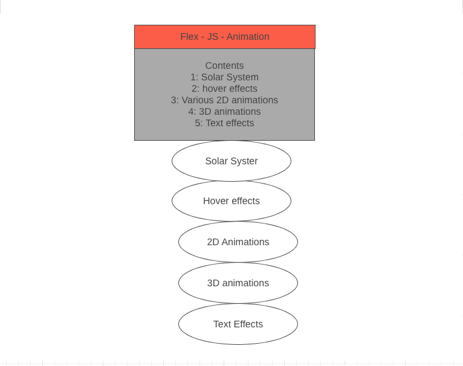

# README

# Introduction 
This is the Flex-animation app. The app demonstrate awesome animations like 2d revolutions, hover effects, 3D effects.

# Live Site
to access the app in heroku, go to
https://bilalbilal197.github.io/Flex-JS-Animation/

# technologies used
The technologies for used to build this app include Vanilla Javascript, CSS3 and HTML5.

# Wireframe

https://wireframe.cc/atMPyJ

# Challenges faced
Vanilla Javascript is best for making 2D animations. 3D.js is a more suitable library for creating 3D animations. 

# Code snippets
code snippet here

# Future Direction 
Refininig the project to include a more 2d and 3d animations. 

# MVP List

Hosting on github live (10/20/2019)

Using DOM manipulation for the first part (11/04/2019)

learn and implement spinning animation (11/05/2019)

learn general CSS animation and create a seperate section with 6 to 9 2D animations (11/06/19)

create 3D animation using 3D.js (11/07/19)

create a solar system using CSS spinner effects (11/08/19)

Production README (11/10/2019, 0.5 days)
